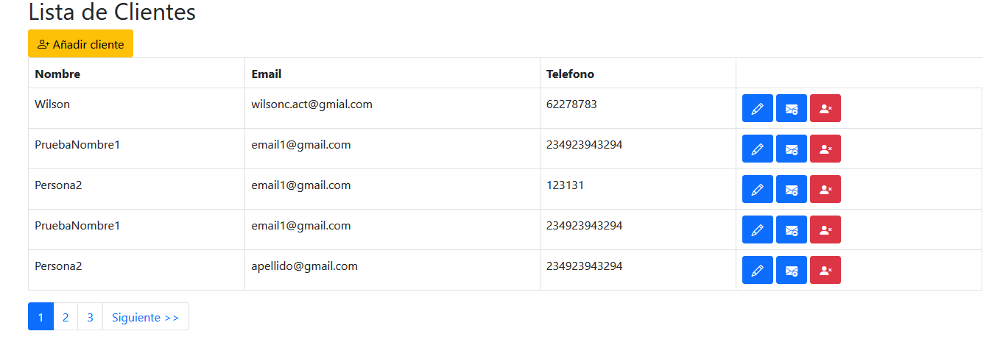

Proyecto de gestión de clientes CRUD
=======

Todo esto se ha realizado bajo el patrón de diseño MVC y el almacenamiento de datos se ha realizado bajo una base de datos en MySQL, con las tablas de Cliente, Interes, Cliente_Interes.

Se mostrará como es la navegación y la solución al problema que se ha planteado.

Lista de clientes con paginación:

He añadido como columnas los datos que considero que son los más importantes.

En este caso he optado por la edición del cliente como una vista de los detalles del cliente y ha su vez como una edición.

