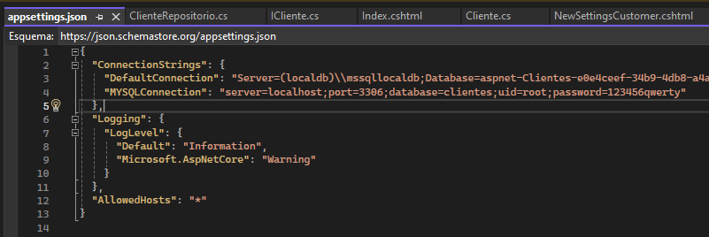
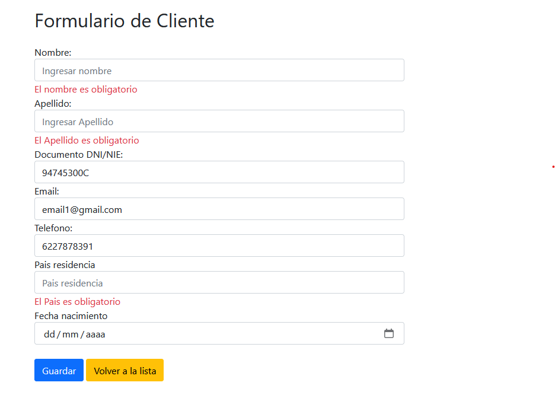
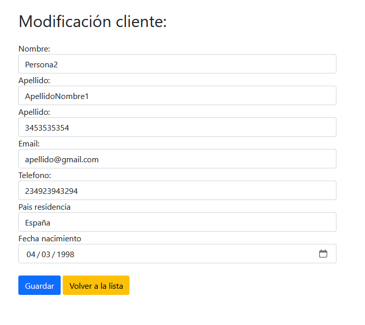
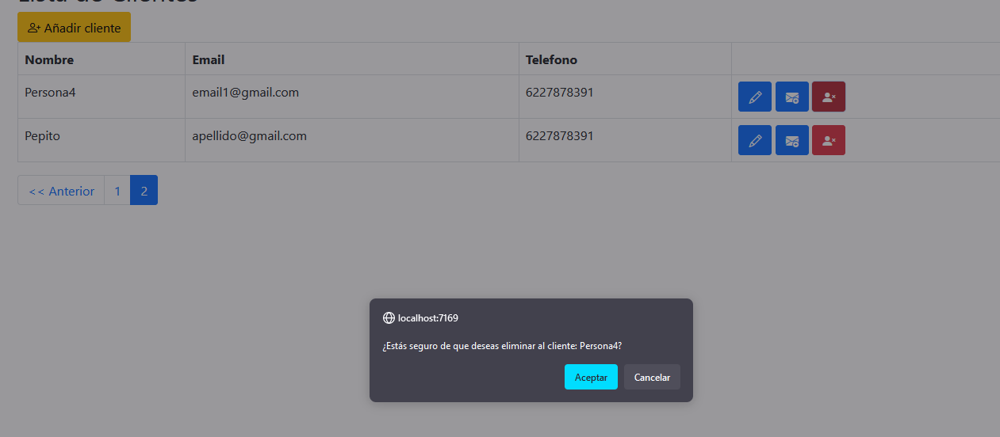
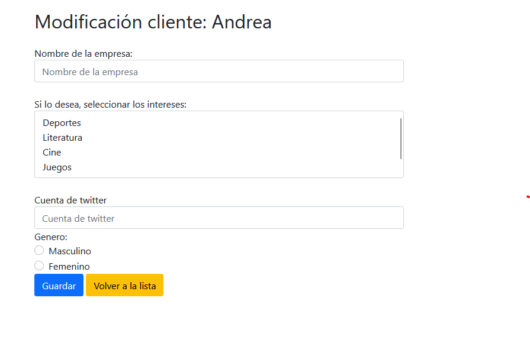
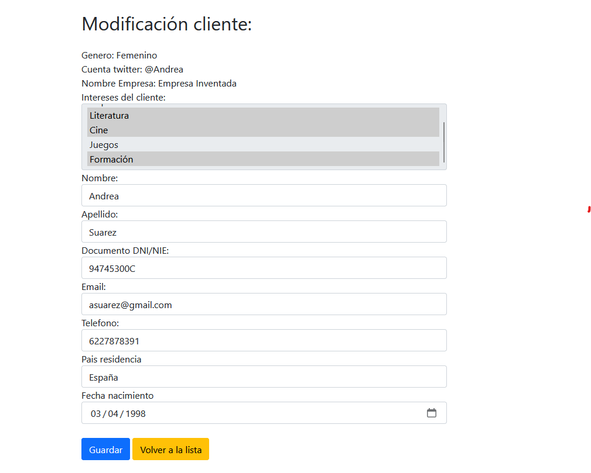

Proyecto de gestión de clientes CRUD
=======

Todo esto se ha realizado bajo el patrón de diseño MVC y el almacenamiento de datos se ha realizado bajo una base de datos en MySQL, con las tablas de Cliente, Interes, Cliente_Interes.
La base de datos está dentro del rar ClienteBBDD, con algunos datos, la configuración que he usado para la BBDD es la siguiente:

Se mostrará como es la navegación y la solución al problema que se ha planteado.

Lista de clientes con paginación:

He añadido como columnas los datos que considero que son los más importantes y su paginación.

Para la creación de un cliente he añadido restricciones en la parte de telefono, documento de identidad y todos los datos son obligatorios.

En este caso he optado por la edición del cliente como una vista de los detalles del cliente y a su vez como una edición.

Para la eliminación de un cliente, siempre se pedirá verificación previa. Una vez aceptada el cliente se eliminará de la base de datos y se actualizará la lista.

Para el envío de correo, he optado por hacer un formulario con los datos relacionados entre cliente y los datos opcionales, ya que no sabría muy bien como mandar un correo, en la base de datos añado la url que genera el formulario para el cliente.

Una vez guardado los datos nuevos, si me voy a la edición o del cliente que he añadido nuevos datos, podré ver la modificación que se ha hecho, sin poder actualizarlos, ya que esa parte estaría hecha en la parte de cliente, el formulario se irá adaptando según los datos opcionales que falten.

Con esto concluiría el formulario y la vista del cliente.